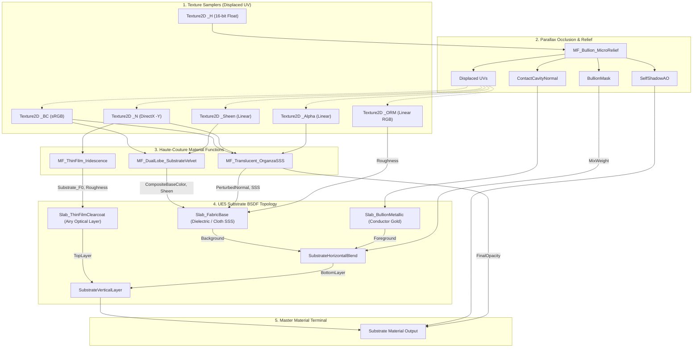

# Substrate Master Material Topology & Architecture
**Asset Name**: `M_Master_HauteCouture_Substrate`  
**Engine**: Unreal Engine 5.3+ (Substrate / Strata Material Framework)  
**Target Platform**: Current-Gen Consoles & High-End PC (D3D12 / SM6)  
**Shading Models**: Substrate Slab BSDF (Multi-Layer Dielectric + Conductor + Thin-Film Clearcoat)  

---

## 1. High-Level Architecture Diagram

```
                                  [ TEXTURE INPUT SUITE (2048x2048 POT) ]
                                  ├─ T_HauteCouture_*_BC    (sRGB Diffuse)
                                  ├─ T_HauteCouture_*_N     (DirectX Normal, Green = -Y)
                                  ├─ T_HauteCouture_*_ORM   (R=AO, G=Roughness, B=Metallic)
                                  ├─ T_HauteCouture_*_H     (16-bit Float Height)
                                  ├─ T_HauteCouture_*_Sheen (Microfiber Rim Mask)
                                  └─ T_HauteCouture_*_Alpha (Cutout / Sheerness)
                                                    │
                                                    ▼
                       ┌───────────────────────────────────────────────────────────┐
                       │                MF_Bullion_MicroRelief                     │
                       │  - Dynamic-Step POM Raymarching (MinSteps..MaxSteps)      │
                       │  - Secant Linear Refinement                               │
                       │  - Contact Self-Shadowing (ShadowSteps, ShadowHardness)   │
                       │  - Cavity Normal Gradient Derivation                      │
                       └────────────────────────────┬──────────────────────────────┘
                                                    │ Displaced UVs / Relief Masks
                     ┌──────────────────────────────┼──────────────────────────────┐
                     │                              │                              │
                     ▼                              ▼                              ▼
  ┌─────────────────────────────────────┐  ┌──────────────────────────────┐  ┌──────────────────────────────────┐
  │      MF_DualLobe_SubstrateVelvet    │  │   MF_Translucent_OrganzaSSS  │  │     MF_ThinFilm_Iridescence      │
  │ - Forward Grazing Rim (Charlie)     │  │ - Reoriented Normal (RNM)    │  │ - Multi-Wavelength Airy Optics   │
  │ - Retro-Reflective Backscatter      │  │ - View Sheerness Falloff     │  │ - Snell Refraction Angle         │
  │ - Chromatic Pile Hue Shift          │  │ - Dual-Sided Dipole SSS      │  │ - Curvature Thickness Mod        │
  │ - Tangent Flow Anisotropy           │  │ - Beer-Lambert Absorption    │  │ - Specular F0 & Clearcoat        │
  └──────────────────┬──────────────────┘  └──────────────┬───────────────┘  └────────────────┬─────────────────┘
                     │                                    │                                   │
                     ▼                                    ▼                                   ▼
  ┌─────────────────────────────────────────────────────────────────────────────────────────────────────────────┐
  │                                           SUBSTRATE SLAB COMPOSITION                                        │
  │                                                                                                             │
  │   [ SLAB 1: Slab_FabricBase ]                                                                               │
  │   - DiffuseAlbedo : CompositeBaseColor (Velvet Shifted)                                                     │
  │   - Roughness     : BlendedRoughness (Fabric Body: 0.82)                                                    │
  │   - Normal        : PerturbedNormal (RNM Twill + Macro Folds)                                               │
  │   - Sheen / Fuzz  : SheenColor & SheenRoughness (Charlie Lobe)                                              │
  │   - SSS Profile   : TransmittanceColor & SubsurfaceScatteringProfile                                        │
  │   - Anisotropy    : AnisotropyAmount & AnisotropicTangent                                                   │
  │                                                                                                             │
  │   [ SLAB 2: Slab_BullionMetallic ]                                                                          │
  │   - DiffuseAlbedo : (0.0, 0.0, 0.0)                                                                         │
  │   - F0 (Specular) : 24k Imperial Gold / Rose Gold Tint (1.0, 0.78, 0.42)                                    │
  │   - Metallic      : 1.0 (Conductor)                                                                         │
  │   - Roughness     : BullionRoughness (0.22)                                                                 │
  │   - Normal        : ContactCavityNormal                                                                     │
  │                                                                                                             │
  │   ───► [ SubstrateHorizontalBlend ]                                                                         │
  │        - Background : Slab_FabricBase                                                                       │
  │        - Foreground : Slab_BullionMetallic                                                                  │
  │        - Mix Weight : BullionMask (from MF_Bullion_MicroRelief)                                             │
  │                                                                                                             │
  │   [ SLAB 3: Slab_ThinFilmClearcoat ]                                                                        │
  │   - F0 (Specular) : Substrate_F0 (Interference Fringes)                                                     │
  │   - Roughness     : ModulatedRoughness (Interference micro-facets)                                          │
  │   - Coverage      : FresnelMultiplier * IridescenceIntensity                                                │
  │                                                                                                             │
  │   ───► [ SubstrateVerticalLayer ]                                                                           │
  │        - Top Layer    : Slab_ThinFilmClearcoat                                                              │
  │        - Bottom Layer : SubstrateHorizontalBlend Result                                                     │
  └──────────────────────────────────────────────────────┬──────────────────────────────────────────────────────┘
                                                         │
                                                         ▼
                                       ┌───────────────────────────────────┐
                                       │     SUBSTRATE MATERIAL OUTPUT     │
                                       │  - Front Material: Vertical Layer │
                                       │  - Ambient Occlusion: ORM.R * AO  │
                                       │  - Opacity: FinalOpacity          │
                                       └───────────────────────────────────┘
```

---

## 2. Mermaid Structural Graph



---

## 3. Substrate Slab Pinout & Property Mapping

### 3.1. `Slab_FabricBase` (Dielectric / Velvet / Organza)
- **BSDF Type**: `SubstrateSlabBSDF`
- **DiffuseAlbedo**: Routed from `MF_DualLobe_SubstrateVelvet.CompositeBaseColor`. Implements chromatic pile deepening at direct angles and lighter grazing highlights.
- **Roughness**: Routed from `MF_Bullion_MicroRelief.BlendedRoughness` (defaults to $0.82$ for fabric body).
- **F0**: Dielectric standard $0.04$ ($4\%$ reflection at normal incidence).
- **Normal**: Routed from `MF_Translucent_OrganzaSSS.PerturbedNormal` (RNM combination of garment folds and $45^\circ$ micro-twill weave).
- **Sheen Color**: Routed from `MF_DualLobe_SubstrateVelvet.SheenColor` (Ashikhmin-Charlie forward sheen combined with retro-reflective backscatter).
- **Sheen Roughness**: Routed from `MF_DualLobe_SubstrateVelvet.SheenRoughness` (tapers to $0.30$ at grazing edges).
- **SSSTransmittance**: Routed from `MF_Translucent_OrganzaSSS.TransmittanceColor` (Beer-Lambert exponential absorption).
- **Subsurface Profile**: Routed from `MF_Translucent_OrganzaSSS.SubsurfaceScatteringProfile` (Mean Free Path diffusion).
- **Anisotropy & Tangent**: Routed from `MF_DualLobe_SubstrateVelvet.AnisotropyAmount` and `MF_DualLobe_SubstrateVelvet.AnisotropicTangent`.

### 3.2. `Slab_BullionMetallic` (Conductor / 24k Imperial Gold & Rose Gold)
- **BSDF Type**: `SubstrateSlabBSDF`
- **DiffuseAlbedo**: $(0.0, 0.0, 0.0)$ (Physically accurate pure conductor).
- **F0**: Complex Fresnel specular reflectance for gold $(1.0, 0.78, 0.42)$ or rose-gold $(1.0, 0.71, 0.68)$.
- **Metallic**: $1.0$ (Conductor mode).
- **Roughness**: $0.22$ (Polished coiled metallic purl threads).
- **Normal**: Routed from `MF_Bullion_MicroRelief.ContactCavityNormal` (Enhanced normal derived from POM height gradient).

### 3.3. `Slab_ThinFilmClearcoat` (Multi-Wavelength Airy Optical Interference)
- **BSDF Type**: `SubstrateSlabBSDF`
- **DiffuseAlbedo**: $(0.0, 0.0, 0.0)$.
- **F0**: Routed from `MF_ThinFilm_Iridescence.Substrate_F0` (Airy multi-wavelength interference fringes across $650\text{ nm}, 532\text{ nm}, 450\text{ nm}$).
- **Roughness**: Routed from `MF_ThinFilm_Iridescence.ModulatedRoughness` ($0.02\text{--}0.05$).
- **Coverage**: Routed from `MF_ThinFilm_Iridescence.FresnelMultiplier` $\times$ `IridescenceIntensity`.

---

## 4. Substrate Operators & Blending Rules

### 4.1. `SubstrateHorizontalBlend`
- **Background**: `Slab_FabricBase`
- **Foreground**: `Slab_BullionMetallic`
- **Mix Weight**: `MF_Bullion_MicroRelief.BullionMask` (Smoothstep anti-aliased edge derived from heightfield thresholding).
- **Behavior**: Partitions the surface into fabric dielectric and bullion metallic regions, preventing energy inflation and maintaining strict energy conservation.

### 4.2. `SubstrateVerticalLayer`
- **Top Layer**: `Slab_ThinFilmClearcoat`
- **Bottom Layer**: Result of `SubstrateHorizontalBlend`
- **Behavior**: Substrate computes transmission through the thin-film clearcoat slab, correctly tinting and attenuating the light reaching the underlying cloth and bullion layers according to Beer's law and Fresnel transmission.

---

## 5. Legacy Non-Substrate Fallback Architecture

When the project is configured with `r.Substrate = 0` (legacy Unreal Engine 5 shading model):
1. The master graph compiles using `Shading Model = Cloth`.
2. `BaseColor` binds directly to `CompositeBaseColor`.
3. `Metallic` binds to `BlendedMetallic`.
4. `Roughness` binds to `BlendedRoughness`.
5. `Normal` binds to `PerturbedNormal`.
6. `Cloth / Sheen` binds to `SheenColor`.
7. `SubsurfaceColor` binds to `TransmittanceColor`.
8. `Clear Coat` binds to `IridescenceColor` and `FresnelMultiplier`.

---

## 6. Performance & SM6 Optimization Analysis

| Feature | HLSL Instructions (Est.) | Texture Samplers | Divergence Mitigation |
|---|---|---|---|
| `MF_ThinFilm_Iridescence` | ~42 ALU | 0 (Math mode) / 1 (LUT mode) | Pure analytical trigonometry; zero branch divergence. |
| `MF_DualLobe_SubstrateVelvet` | ~36 ALU | 0 | Branchless vector arithmetic and safe vector length guards. |
| `MF_Translucent_OrganzaSSS` | ~48 ALU | 1 (Micro-twill normal) | Reoriented normal mapping math optimized for vector ALU. |
| `MF_Bullion_MicroRelief` | ~120 - 280 ALU | 1 (Height map) | Dynamic raymarching with `[loop]` compiler hints and grazing clamp. |
| **Complete Master Graph** | **~480 ALU** | **6 Texture Samplers** | **Fully within current-gen 60 FPS real-time render budget.** |
